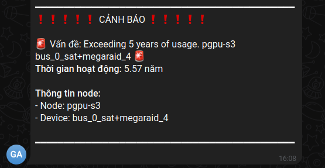
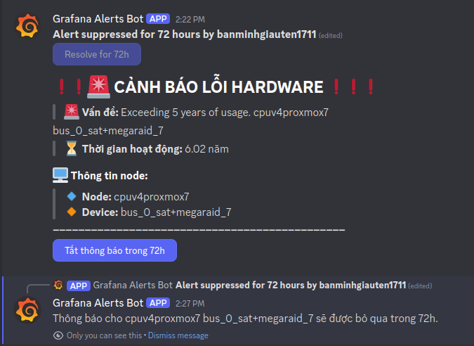

# A custom WebHook server for Grafana which will send message through a Proxy Server

Support only for Discord and Telegram

Remember to add these environment variables into your .env:
```
# Telegram
BOT_TOKEN=<YOUR_TELEGRAM_BOT_TOKEN>
CHAT_ID=<YOUR_TELEGRAM_CHAT_ID>

# Proxy
PROXY_URL=<YOUR_PROXY_URL> # For example: http://1.2.3.4:1234
PROXY_TYPE=<YOUR_PROXY_TYPE> # Just support for socks5
PROXY_USER=<YOUR_PROXY_USERNAME>
PROXY_PASS=<YOUR_PROXY_PASSWORD>

# Discord
DISCORD_URL=<YOUR_DISCORD_WEBHOOK_URL>
```

## I. Instruction for run binaries file
```bash
go build -ldflags="-s -w"
```

### Run
```bash
./webhook-server
```

## II. Instruction for run docker container

### 1. Build Docker image
```bash
docker build -t webhook-server:latest .
```

### 2.
```bash
docker run -dp 8080:8080 --name webhook-server webhook-server:latest

```

## II. Results Demo

### 1. Telegram


### 2. Discord

