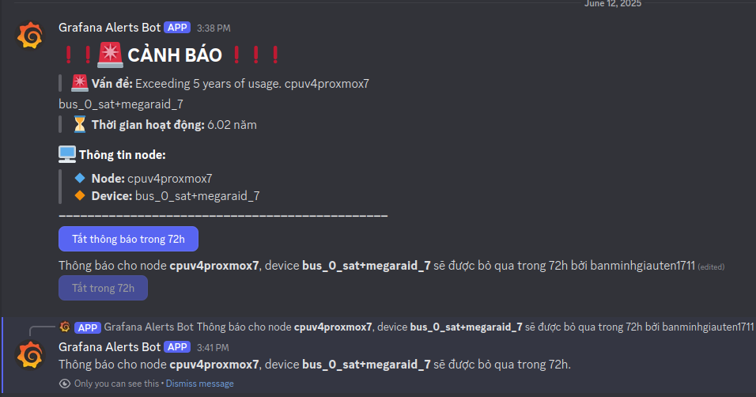

# A custom WebHook server for Grafana which will send message through a Proxy Server

Support only for Discord and Telegram

## I. Installation
```bash
$ go build -ldflags="-s -w"
```

### Run
```bash
.\webhook-proxy
```

## II. Results Demo
#### 1. Telegram


#### 2. Discord

